## Demo on Youtube
Click on the image to play the demo on Youtube

## Architecture
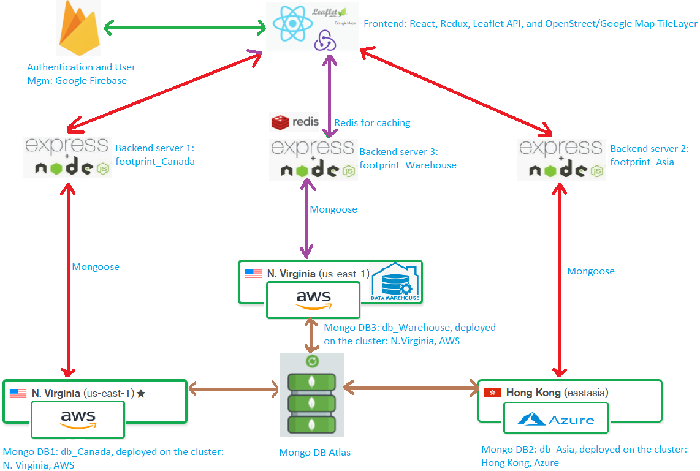

## User manual
Step 1: register, login, and edit your profile (avatar, region...) by clicking the default avatar. If you select Asia as your region, all your requests will be sent to the Asian backend server and all your application data will be stored into the footprint_Asia mongo db. Save avatar, submit updates, and you will be directed to the default page: “Mark your footprints”. You can see only two menu tabs on the side bar as you are not the administrator, and you can see your updated avatar.
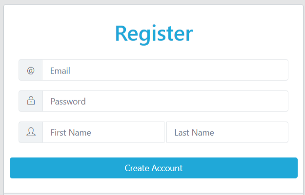 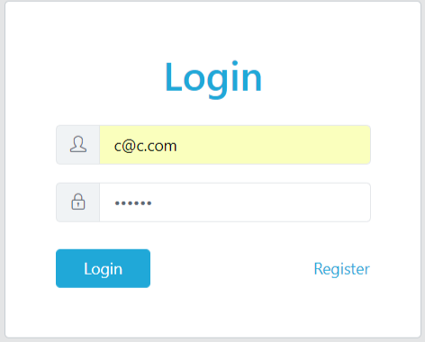
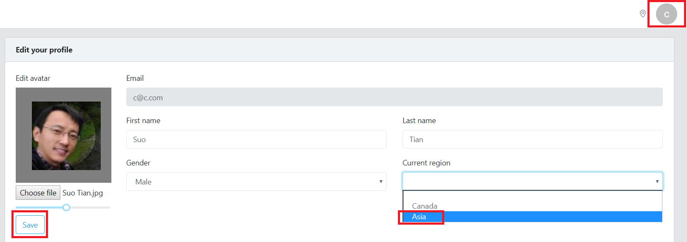
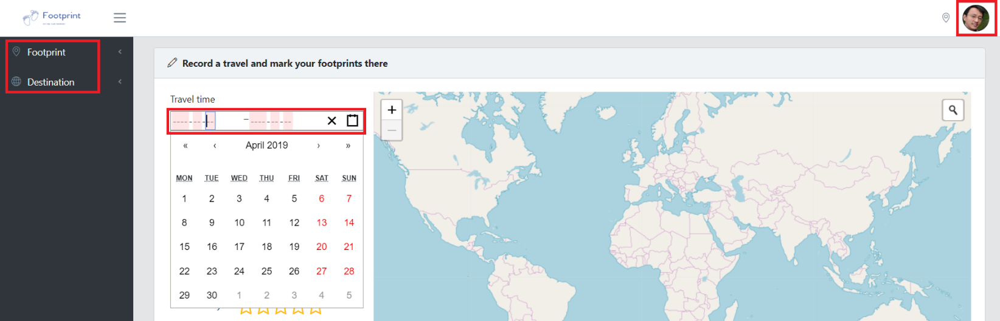
All users’ profile info will be stored into Google Firebase database server. In addition, firebase also conducts authentication and validation.
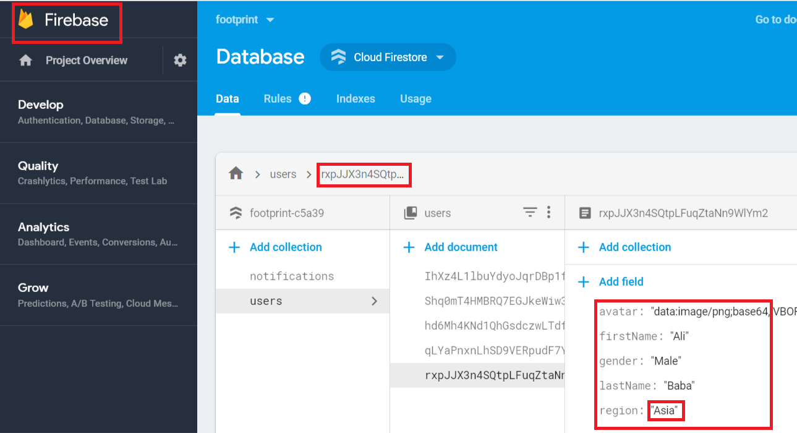
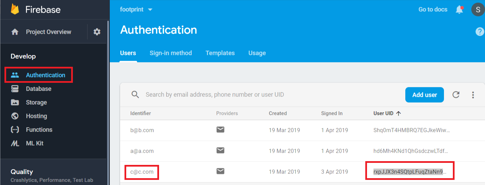

Step 2: Record a travel and mark your footprints there. The travel time is a “react-daterange-picker” component and the map is an OpenStreetMap tile layer operated by Leaflet APIs. City is a “react-autosuggest” component with a cities.json dataset. Click on one city label to let the map pan to it. You may also want to input the cost of that travel, select the type of the city, and rate it.

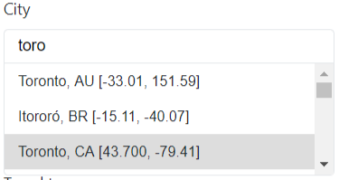 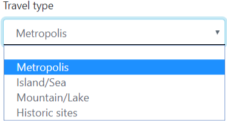
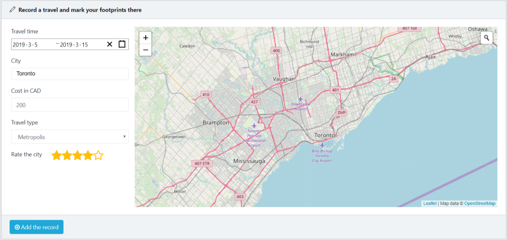
Zoom in/out the map or use the geocoder search tool at the top right to find detailed venues that you have visited. Mark them on the map as your footprints or unmark them by clicking on the marker.
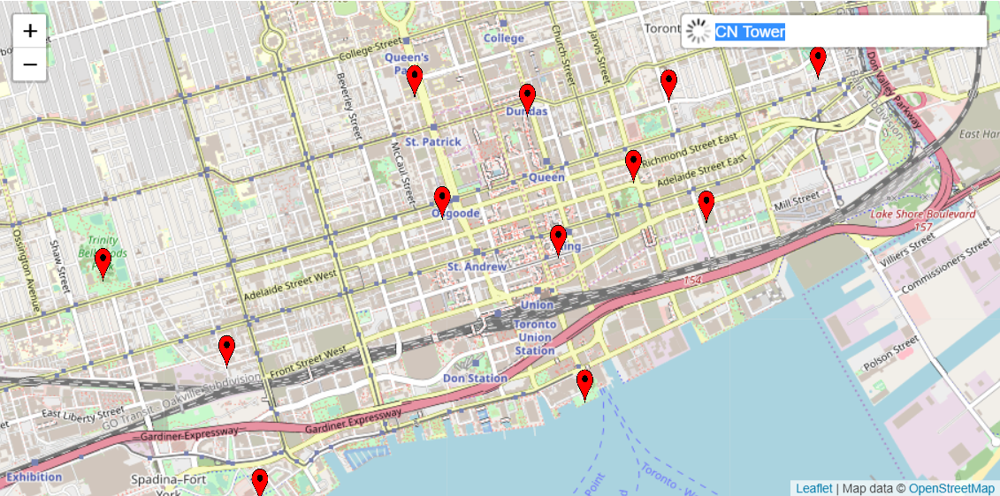

Step 3: Click on the “Add the record” button, the page redirects to the “List your footprints” page, showing your previous travel records and footprints in map clusters. You can add more cities. Clicking one cluster on the map shows all the footprint markers or maybe some sub-clusters.
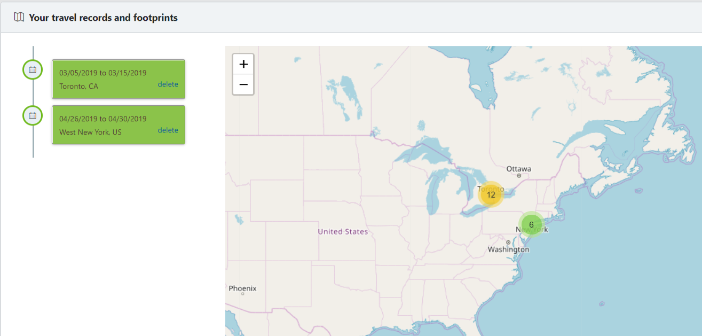
Click on the center of a calendar center in the timeline component, that pertinent city (New York) will be zoomed in. Click on another calendar, the map will trigger an animation flying to that city (Toronto)
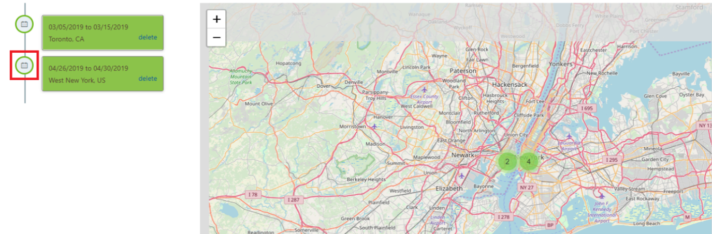
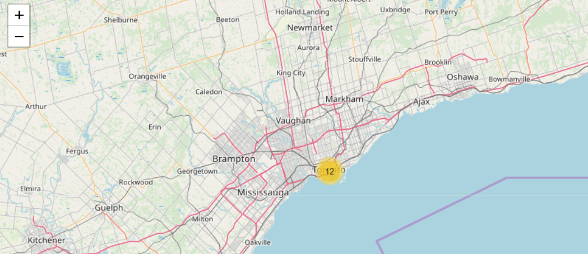
Click on the delete link, the city disappears from the timeline list, the cluster and footprint markers disappear from the map, and the data is deleted from the database.
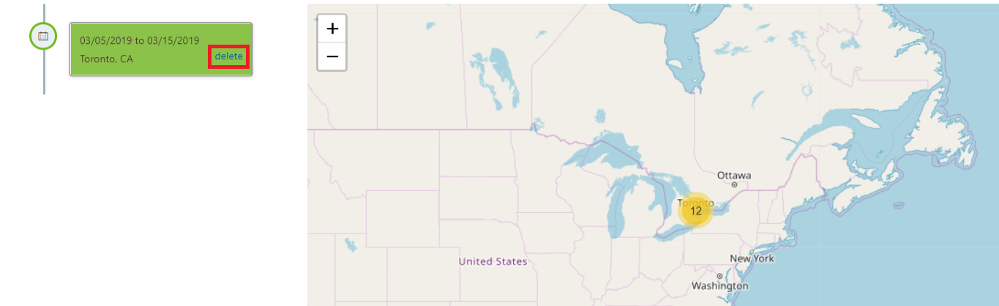
Now that we had added two cities Toronto and New York, and later deleted New York, we should have one record (Toronto) left in the database. travels.city is the foreign key referring to the city entity.
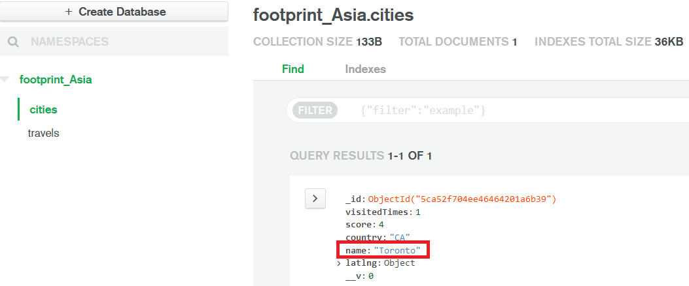
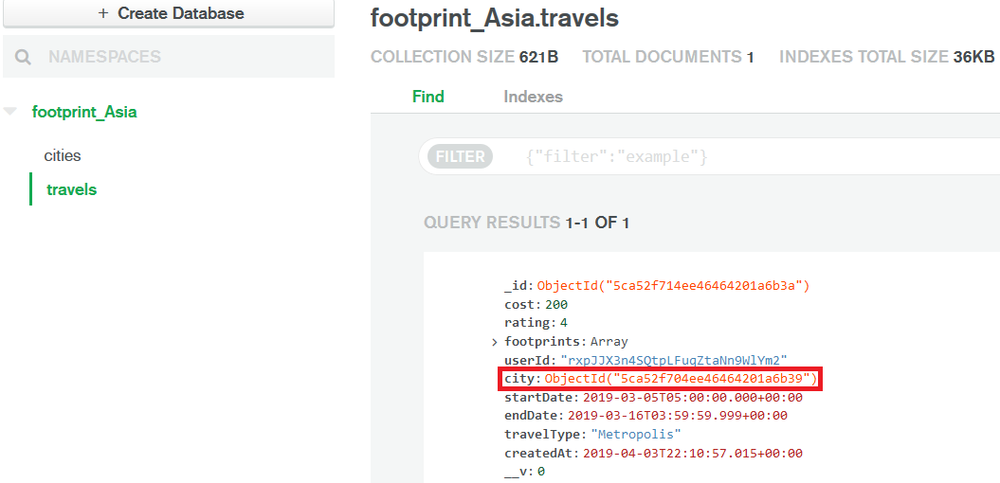

Step 4: log in with an administrative account, then you can see a “Warehouse” tab on the side bar. Let’s first fill 100 sample travel records into source db1 footprint_Canada and then synchronize them together with the one record in db2 footprint_Asia to the warehouse.
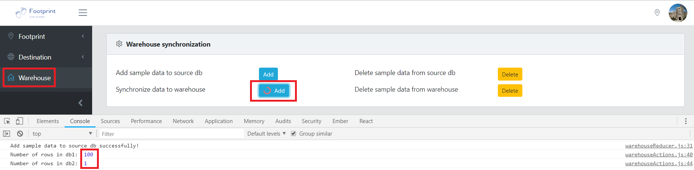
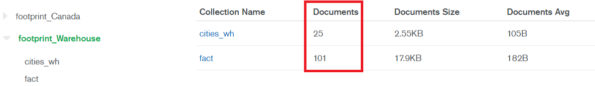
The 100 sample travel records within 25 sample cities are well distributed by using the random-seed component, which makes further mining or queries really random each time. The application also provides deletion features.

 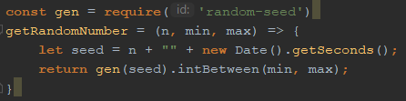
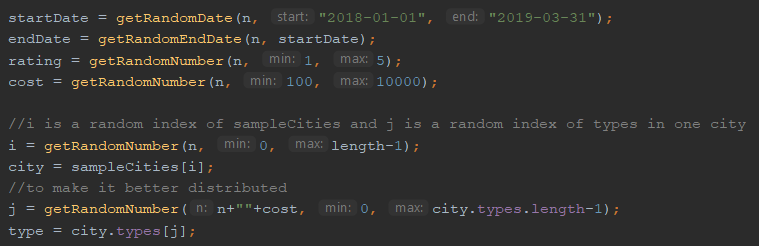
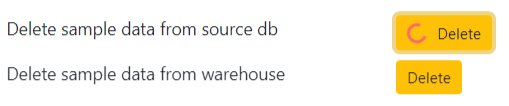

Step 5: Go to the “Destination/The top cities” page, customize the query criteria, and you will see a city list result rendered in the form of a timeline list and some thumbnails on a Google Map. You can click on one of the toggle buttons to extend the main page, click on the calender icon of one city to trigger an animation flying the map to that city, or click on the thumbnail to trigger a modal lightbox showing a larger picture of that city.
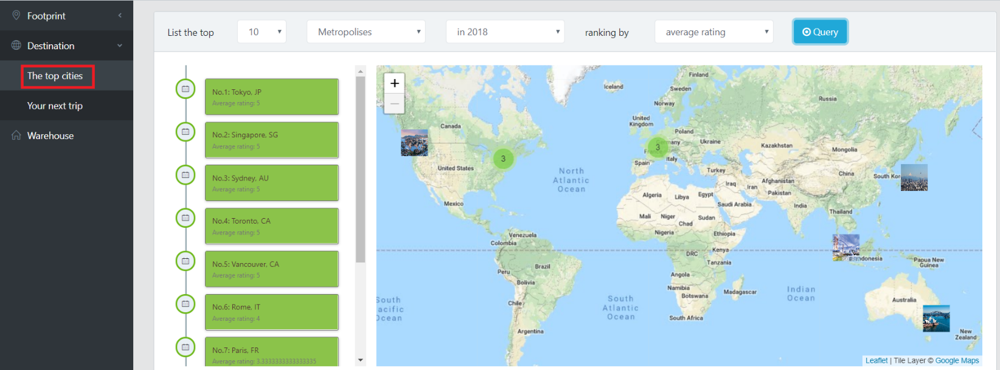
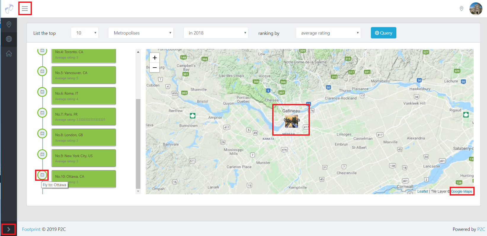
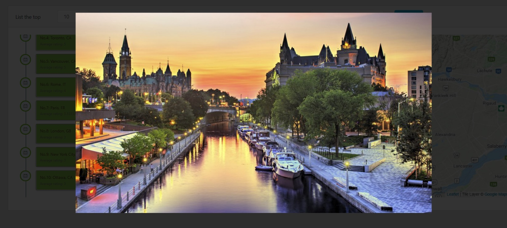
Change the query string to get specified lists. The search will first be executed in Redis and then if unsuccessful from the warehouse db and meantime the returned result will be added to Redis with a key consisting of query conditions for further query by any user.

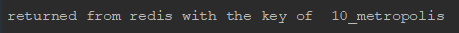
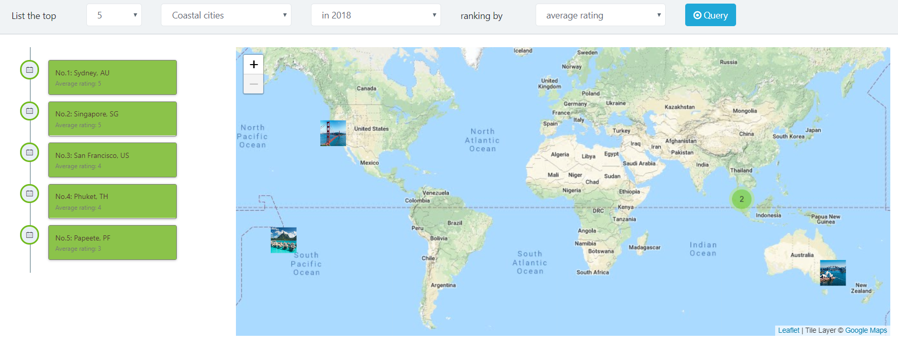
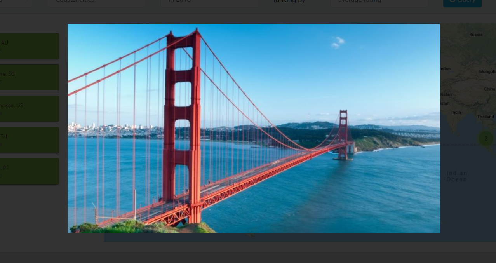

## Deploy the application
Step 1: Clone the frontend source code: https://github.com/hongshuidang/footprint_frontend.git to a local repository, and run “npm start” to open the frontend app at http://localhost:3000

Step 2: Clone the backend source code from https://github.com/hongshuidang/footprint_backend.git, and then execute “npm start” to run the backend server 1(assume it is the Canadian server) at port 3001.

Step 3: Copy the backend source code to another folder, rename it, change the port in the “index.js” file to 3002, and execute “npm start” to run the backend server 2, assuming the Asian server.

Step 4: Clone the warehouse source code from https://github.com/hongshuidang/footprint_backend_warehouse.git and run “npm start” to launch the warehouse server at port 3004.
